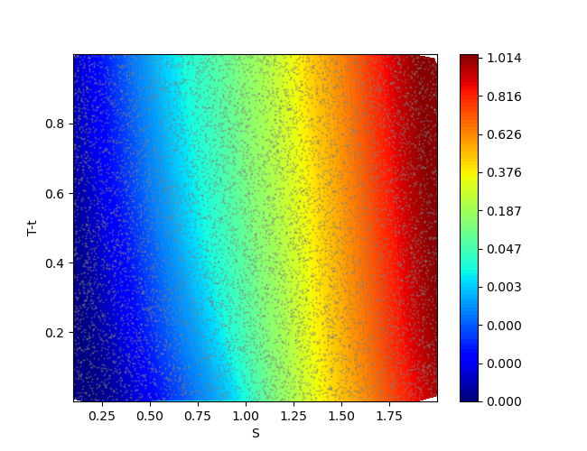
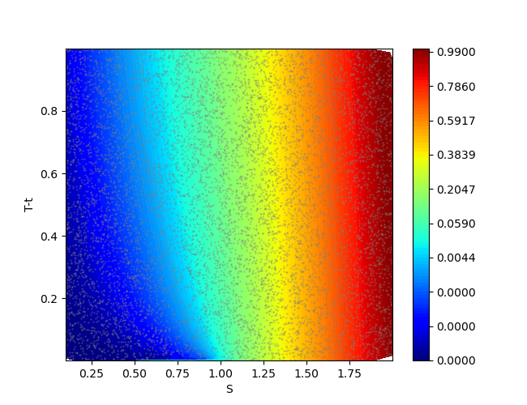

## CGDPO-ML 알고리즘 소개

CGDPO-ML(CGDPO - Martingale Loss)은 policy update에만 집중하는 CGDPO 알고리즘을 policy evaluation까지 되게끔 확장하여 금융 분야의 option pricing에 응용하는 강화학습 알고리즘입니다. 물론 금융 분야 이외의 stochastic optimal control problem에도 적용될 수 있습니다.

본 알고리즘은 다음 연구자에 의해 개발되었습니다:
* 성균관대 수학과 허정규 교수
* 북경대 HSBC 경영대학 최재혁 교수
* 성균관대 수학과 김지훈 학생

궁금한 점이 있으시면 허정규 교수에게 메일(jghuh@skku.edu)로 문의 부탁드립니다. 이 프로젝트는 현재 진행중으로 연구에 이용하신다면 다음을 인용 부탁드립니다.

Huh, J., Koo, H. K., & Lim, B. H. (2024, July). Continuous-time portfolio optimization via model-based reinforcement learning [Paper presentation]. 2024 Asia/Pacific Conference, Financial Management Association International, Seoul, South Korea.

## CGDPO 알고리즘의 특징

CGDPO 알고리즘은 REINFORCE 알고리즘의 변형으로 다음과 같은 특징이 있습니다.

1. 모델 기반 강화학습
2. 정책 기반 강화학습
3. 역전파를 이용한 정책 신경망의 직접 학습
4. 연속 시간 문제 해결을 위한 초기 상태 랜덤 샘플링
5. 오차가 높은 부분을 타개하기 위한 어댑티브 샘플링
   
REINFORCE 알고리즘과 1,2번은 동일하지만 3,4,5번에서 차별화됩니다. CGDPO에 관한 자세한 설명이 필요한 분은 다음 GitHub를 참고하세요:
[CGDPO GitHub](https://github.com/huhjeonggyu/cgdpo/tree/main)

## CGDPO-ML 알고리즘의 세부 설명

CGDPO-ML 알고리즘은 policy update에만 집중하는 CGDPO 알고리즘을 policy evaluation까지 되게끔 확장한 알고리즘입니다. 다시 말해, 

CGDPO-ML = CGDPO : 정책 개선 + ML : 가치 평가

CGDPO에서는 policy network만 등장하고 value network는 나타나지 않는 반면, CGDPO-ML에서는 두 유형의 신경망이 모두 등장합니다. 그럼에도 policy update에 value network가 직접적으로 관여하지 않기 때문에 여전히 정책 기반 강화학습으로 분류되어야 합니다.

* Jia, Y., & Zhou, X. Y. (2022). Policy gradient and actor-critic learning in continuous time and space: Theory and algorithms. Journal of Machine Learning Research, 23(275), 1-50.

위 연구는 연속 확률 모형에서 policy evaluation에 대한 핵심적 이론을 제공합니다. 이 연구에서 CGDPO-ML을 위해 차용한 것은 아래와 같습니다.

1. Martingale loss를 이용한 policy evaluation
2. Martingale orthogonality condition을 이용한 어댑티브 샘플링의 개선

## CGDPO-ML과 MC의 성능 비교

2024년 9월 기준으로 본 알고리즘은 option pricing을 하는 가장 유연한 도구 중 하나입니다. 이론적으로는 어떤 model이 제시되든지 간에 짧은 시간 안에 모든 종류의 option 종류에 대한 pricing이 가능합니다. 우선 이론이 잘 작동하는지 확인하기 위해 본 연구에서는 Black-Scholes model에서 아래 3가지 옵션에 대해 실험이 진행되었습니다. 벤치마크 방법은 option pricing을 위해 널리 사용되는 유한차분법(FDM)과 몬테카를로 시뮬레이션(MC) 입니다.

### European Vanilla Call
| | 1min | 5min | 10min | 30min | 60min |
|--------|------|------|------|-------|-------|
| CGDPO-ML |  |  | |  |  |
| FDM |  |  |  |  |  |
| MC |  |  |  |  |  |

### American Vanilla Call
| | 1min | 5min | 10min | 30min | 60min |
|--------|------|------|------|-------|-------|
| CGDPO-ML |  |  | |  |  |
| FDM |  |  |  |  |  |
| MC |  |  |  |  |  |

### European Basket Call (2 assets)
| | 1min | 5min | 10min | 30min | 60min |
|--------|------|------|------|-------|-------|
| CGDPO-ML |  |  | |  |  |
| FDM |  |  |  |  |  |
| MC |  |  |  |  |  |

### European Basket Call (5 assets)
| | 1min | 5min | 10min | 30min | 60min |
|--------|------|------|------|-------|-------|
| CGDPO-ML |  |  | |  |  |
| FDM |  |  |  |  |  |
| MC |  |  |  |  |  |

### European Basket Call (30 assets)
| | 1min | 5min | 10min | 30min | 60min |
|--------|------|------|------|-------|-------|
| CGDPO-ML |  |  | |  |  |
| FDM |  |  |  |  |  |
| MC |  |  |  |  |  |

### American Basket Call (2 assets)
| | 1min | 5min | 10min | 30min | 60min |
|--------|------|------|------|-------|-------|
| CGDPO-ML |  |  | |  |  |
| FDM |  |  |  |  |  |
| MC |  |  |  |  |  |

### American Basket Call (5 assets)
| | 1min | 5min | 10min | 30min | 60min |
|--------|------|------|------|-------|-------|
| CGDPO-ML |  |  | |  |  |
| FDM |  |  |  |  |  |
| MC |  |  |  |  |  |

### American Basket Call (30 assets)
| | 1min | 5min | 10min | 30min | 60min |
|--------|------|------|------|-------|-------|
| CGDPO-ML |  |  | |  |  |
| FDM |  |  |  |  |  |
| MC |  |  |  |  |  |

## CGDPO-ML의 기여

이 알고리즘은 다음의 측면에서 기여합니다:

* 짧은 시간 안에 임의의 model에서 임의의 option에 관한 유연한 pricing 방법 제공
* 고차원 option pricing 문제에 관한 강력한 강화학습 기반 솔루션

## CGDPO-ML의 결과

### European Vanilla Call

    
    

왼쪽은 소비량을 예측하는 신경망 결과이고, 오른쪽은 투자량을 예측하는 신경망의 결과물입니다. 5분만에 매우 정확한 답을 얻음을 확인할 수 있습니다. 에러가 작다는 사실은 매칭되는 아래의 에러에 관한 그림을 봐도 확인됩니다.
